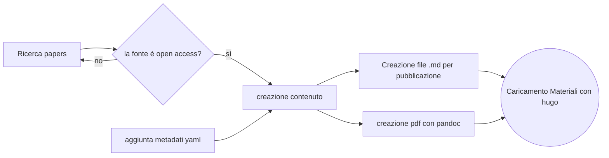

![[relazione/img/minerva.png]]
# EdiNews

Raccolta di _sintesi_ e _analisi_ sui principali temi di attualità 

## Introduzione

il progetto ha l'obbiettivo di creare un contenuto editoriale accessibile a giornalisti e operatori dell'informazione che riassuma il risultato dei più recenti studi su un determinato argomento. 

il progetto utilizza il framework _Hugo_ per raccogliere e diffondere tramite un sito web statico il contenuto prodotto. 

Il processo ha previsto l'acquisizione e strutturazione di contenuti in _markdown_, e la pubblicazione automatizzata tramite script python su: [EdiNews](https://voksdb.github.io/esercizio_editoria_EdiNews/posts/clima_salute_mentale/), dove ogni articolo è disponibile per il download in formato pdf e .md, oltre che alla lettura online. 

## Ideazione 

### Tema

i temi affrontati negli articoli pubblicati riguarderanno temi come  salute globale, intelligenza artificiale, crisi climatica, agricoltura sostenibile.  

per questi temi è fondamentale l'accesso alla letteratura scientifica e il confronto tra fonti differenti, ma non sempre negli articoli giornalistici pubblicati  è chiaro quali studi siano stati presi come riferimento, creando il rischio di generare disinformazione. 

il progetto ha l'obbiettivo di rendere chiara, rapida e accessibile l'informazione su questi temi, sintetizzando e confrontando alcuni recenti articoli sull'argomento. 

![[relazione/img/edinews.png]]

### Destinatari

- **Anna**, 29 anni, scrittrice freelance per una testata online. Scrive pezzi divulgativi su salute e scienza, cerca fonti verificabili, attraverso il materiale pubblicato potrà facilmente analizzare gli articoli scientifici sull'argomento 

- **Alessandro**, 45 anni, caporedattore di una rivista scientifica mensile. Vuole inserire rapidi aggiornamenti nel prossimo numero.

- **Luca**, 23 anni, youtuber e creatore di short form content, cerca materiale breve e aggiornato riguardante gli ultimi sviluppi sui temi più attivi nel dibattito scientifico. 

___

### Modello di fruizione

il prodotto creato deve essere in un formato che sia ampiamente utilizzato e aggiornabile, e che sia adatto alla pubblicazione sul web. 

la fruizione del contenuto deve essere chiara e accessibile, si deve ottenere un modello di lettura _testuale_, dal tono rigoso, ma non eccessivamente scientifico, il progetto ha l'obbiettivo di rendere chiaro ad un pubblico più ampio il punto degli articoli pubblicati,  per questo è possibile introdurre anche _degli elementi  visuali_ come grafici e diagrammi tratti da essi.  

parlare anche di: 

> Quali standard consideriamo come riferimento? Quali aspetti di innovazione possiamo proporre? Nella qualità dei contenuti o nel processo di fruizione?

### Canali di distribuzione

| Canale                                | Formato         | In che modo                                        |
| ------------------------------------- | --------------- | -------------------------------------------------- |
| Web                                   | HTML            | pubblicazione sul sito EdiNews, con framework hugo |
| Social / newsletter                   | Estratti + link | è possibile ottenere il materiale in .md dal sito  |
| lettura offline/embedding in siti web | PDF             | Conversione in pdf del contenuto, stampabile       |

L’identità visiva è minimale, con uso di stili coerenti L’impaginazione segue modelli editoriali classici delle riviste scientifiche divulgative, ispirato a siti come: 
https://theconversation.com/global

lo stile deve essere formale e ispirare affidabilità in chi ne fruisce, è stato preferito quindi l'utilizzo modelli già presenti sul mercato. 
## Processo di Produzione

### Acquisizione dei contenuti

> Descrivere le fonti che saranno utilizzate nella costruzione del prodotto editoriale. Nella scelta delle fonti valutare il costo di acquisizione: (i) disponibili come fonti libere, (ii) generabili automaticamente, (iii) richiedono un lavoro di redazione manuale.

le fonti utilizzate per redigere il materiale sono articoli scientifici con licenza open access. 

la ricerca delle fonti sull'argomento è stata effettuata su [Google Scholar](https://scholar.google.com/) è stato così possibile selezionare riviste scientifiche che espongono articoli con licenza libera, come [ScienceDirect](https://www.sciencedirect.com/)

altre fonti libere possono essere [Zenodo](https://zenodo.org/) e [PubMed](https://pubmed.ncbi.nlm.nih.gov/), ma ho avuto difficoltà a trovare articoli che riguardassero lo stesso argomento, restano comunque valide alternative per la ricerca. 

per processo di creazione dei contenuti è necessario un lavoro di _redazione manuale_, per la stesura di un file Markdown o di testo che contenga la sintesi/analisi dei documenti raccolti, documento che necessita l'insermento di appropriati metadati in stile yaml

è in teoria possibile generare un'introduzione per l'articolo che raccolga i principali punti chiave degli argomenti automaticamente, tramite AI. 

### Gestione documentale

### Tecnologie adottate

| Tecnologia  | Utilizzo                                                                                                              |
| ----------- | --------------------------------------------------------------------------------------------------------------------- |
| Markdown    | Scrittura modulare, leggibile, aggiornabile, facilmente modificabile da più persone durante la stesura del contenuto. |
| Yaml        | Metadati (autore, tag, abstract), Parametrizzare trasformazioni                                                       |
| pandoc      | Conversione formati (PDF)                                                                                             |
| Python/bash | Script per automatizzare build                                                                                        |
| Git/GitHub  | Gestione versioning + pubblicazione su GitHub pages                                                                   |

### Esecuzione del flusso

[repository del progetto](https://github.com/voksDB/esercizio_editoria_EdiNews)

___

## Valutazione dei risultati raggiunti

### Valutazione del flusso di produzione

> Per valutare il contributo proposto valutare le diverse fasi del flusso in termini di (i) riduzione dei tempi di gestione documentale, (ii) riduzione degli errori, (iii) miglioramento della qualità dei documenti, (iv) miglioramento del livello di accettazione della tecnologia, (v) raggiungimento di nuovi canali di distribuzione, (vi) soddisfacimento di nuovi scenari d'uso.

L'introduzione di script per la generazione e pubblicazione dei documenti ha permesso una riduzione nella preparazione del materiale, in particolare nelle fasi ripetitive come:
- generazione dei file md strutturati per la pubblicazione
- generazione dei file PDF 
- pubblicazione automatica tramite GitHub Pages

L’adozione di standard aperti e di strumenti semplici da usare ha facilitato la portabilità del progetto su diverse piattaforme. 
 
### Confronto con lo stato dell'arte

> Può anche essere utile confrontare una versione ASIS del flusso di gestione, senza la tecnologia o le innovazioni proposte, e una TOBE che include la tecnologia e le innovazioni proposte dallo studente.

nelle prossime versioni si potrebbe migliorare l'integrazione dell'utilizzo dei metadati nell'indicizzazione delle notizie, nel sito la ricerca degli articoli potrebbe avvenire tramite i tag associati nei metadati. 

si potrebbe implementare un controllo tramite AI sul tono, sul lessico e sulla grammatica del linguaggio usato nelle sintesi degli articoli. 
### Limiti emersi

>È importante sottolineare i limiti emersi. Come l'impossibilità di accesso ad alcune tecnologie o fasi del flusso di gestione documentale, limiti nella automazione di alcune passi di trasformazione dei formati o di integrazione delle sorgenti

 La  _ricerca automatizzata delle fonti open access_ è complessa: gli articoli scientifici cercati sono distribuiti su piattaforme diverse, senza API standardizzate per il recupero delle fonti. 

## Conclusioni

> Discutere i risultati ottenuti, verificando se gli obiettivi definiti dai casi d'uso siano pienamente o parzialmente raggiunti. Evidenziare gli aspetti nei quali si sono raggiunti i risultati più soddisfacenti e le limitazioni emerse.

Il progetto ha dimostrato la l’utilità di produrre un contenuto editoriale digitale, orientato a giornalisti e comunicatori, capace di sintetizzare risultati scientifici in modo rigoroso ma accessibile.

obiettivi principali raggiunti:
- produzione di contenuti affidabili, aggiornabili, verificabili
- aggiornabilità e semplicità di utilizzo tramite markdown e hugo
- automazione di parte del flusso documentale

## Bibliografia e sitografia

[jain2022hugo,@heath2025navigating,@mezieobi2025strategies,@mccall2025locating]
